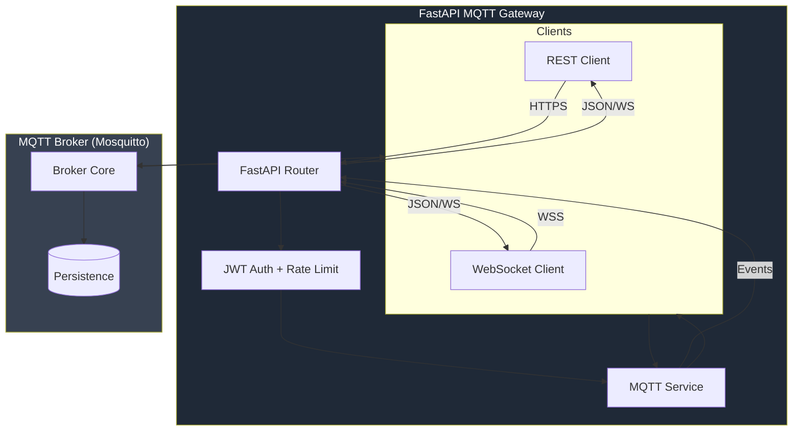
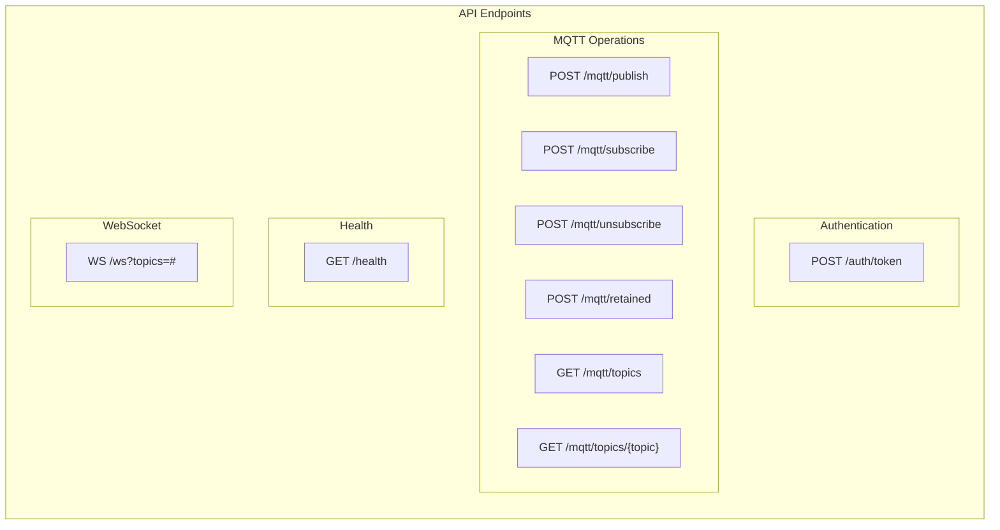

# FastAPI MQTT Gateway


[](https://opensource.org/licenses/MIT)
[](https://hub.docker.com/)
[]()

Production-ready REST/WebSocket → MQTT bridge with authentication, rate limiting, and real-time streaming.

## Features

- **REST API**: Publish, subscribe, unsubscribe, query retained messages
- **WebSocket**: Real-time MQTT message streaming with topic filtering
- **JWT Authentication**: Secure token-based auth with configurable expiry
- **Rate Limiting**: Per-endpoint rate limits via SlowAPI
- **Topic Management**: Subscription tracking, allowed/blocked patterns
- **MQTT v5**: Full MQTT 5.0 support with QoS 0-2, retained messages
- **TLS Support**: Secure broker connections
- **Structured Logging**: JSON logs via structlog
- **OpenAPI Docs**: Auto-generated API documentation
- **Docker Ready**: Multi-service compose with Mosquitto broker

## Architecture



## API Endpoints



## Quick Start

### Docker Compose (Recommended)

```bash
# Clone and configure
git clone <repo> fastapi-mqtt-gateway
cd fastapi-mqtt-gateway
cp .env.example .env
# Set API_USERNAME, a random API_PASSWORD (at least 16 characters), and
# JWT_SECRET_KEY (at least 32 characters). Use openssl rand -hex 32 for secrets.
# Empty values and known placeholders prevent startup.

# Start services
docker-compose up -d

# Check health
curl http://localhost:8000/health
```

### Local Development

```bash
# Install dependencies
pip install -e ".[dev]"

# Start Mosquitto (or use docker-compose for broker only)
docker run -d -p 1883:1883 -p 9001:9001 eclipse-mosquitto:2.0

# Run gateway
uvicorn fastapi_mqtt_gateway.main:app --reload --host 0.0.0.0 --port 8000
```

## Configuration

| Variable | Default | Description |
|----------|---------|-------------|
| `MQTT_BROKER_HOST` | `mqtt-broker` | MQTT broker hostname |
| `MQTT_BROKER_PORT` | `1883` | MQTT broker port |
| `MQTT_USERNAME` | `` | MQTT username (optional) |
| `MQTT_PASSWORD` | `` | MQTT password (optional) |
| `MQTT_USE_TLS` | `false` | Enable TLS |
| `API_USERNAME` | *(required)* | Single API principal, separate from MQTT login |
| `API_PASSWORD` | *(required)* | API password (min 16 characters) |
| `JWT_SECRET_KEY` | *(required)* | JWT signing secret (min 32 chars) |
| `JWT_ACCESS_TOKEN_EXPIRE_MINUTES` | `30` | Access token TTL |
| `RATE_LIMIT_ENABLED` | `true` | Enable rate limiting |
| `LOG_LEVEL` | `INFO` | Log level |

## Usage Examples

### Get Access Token

```bash
curl -X POST http://localhost:8000/auth/token \
  -H "Content-Type: application/x-www-form-urlencoded" \
  -d "username=admin&password=secret"
```

### Publish Message

```bash
TOKEN=<your-token>
curl -X POST http://localhost:8000/mqtt/publish \
  -H "Authorization: Bearer $TOKEN" \
  -H "Content-Type: application/json" \
  -d '{"topic": "gateway/sensors/temp", "payload": "23.5", "qos": 1, "retain": true}'
```

### Subscribe to Topic

```bash
curl -X POST http://localhost:8000/mqtt/subscribe \
  -H "Authorization: Bearer $TOKEN" \
  -H "Content-Type: application/json" \
  -d '{"topic": "gateway/sensors/#", "qos": 1}'
```

### Query Retained Message

```bash
curl -X POST http://localhost:8000/mqtt/retained \
  -H "Authorization: Bearer $TOKEN" \
  -H "Content-Type: application/json" \
  -d '{"topic": "gateway/sensors/temp"}'
```

### WebSocket Streaming

```javascript
const ws = new WebSocket('ws://localhost:8000/ws?topics=gateway/sensors/+,gateway/+/status');
// Obtain accessToken from POST /auth/token using a form body over HTTPS.
ws.onopen = () => ws.send(JSON.stringify({ type: 'auth', token: accessToken }));

ws.onmessage = (event) => {
  const msg = JSON.parse(event.data);
  if (msg.type === 'ping' || msg.type === 'ready') return;
  console.log(`${msg.topic}: ${msg.payload}`);
};
```

Native clients can send `Authorization: Bearer <token>` in the upgrade request.
Browser clients must send the authentication frame within five seconds. No MQTT
subscription or data delivery occurs before authentication. Tokens are never
accepted in URLs. Streams close when the token expires; obtain a fresh token and
reconnect. A `ready` frame confirms that subscriptions have been registered.

ACL rules apply to REST and WebSocket operations. A subscription must fit wholly
inside one allowed filter and must not overlap a blocked filter. For example,
with `sensors/private/#` blocked, request `sensors/public/#` instead of `sensors/#`.
Shared subscriptions are not supported. Overlapping subscriptions are owned per
connection, so disconnecting one consumer does not unsubscribe the others.

Slow clients close with code 1013 when their bounded queue fills or a send times
out. `WEBSOCKET_QUEUE_SIZE` (default 64), `MQTT_QUEUE_SIZE` (default 256), and
`MAX_MESSAGE_BYTES` (default 1048576) bound buffering. The broker ingress keeps
newest messages on overflow; this is a telemetry stream, not a durable event log.

### Upgrade from the previous authentication defaults

Set `API_USERNAME`, `API_PASSWORD`, and a unique `JWT_SECRET_KEY` before deploying.
The broker username/password no longer authorize API calls. Login requires a
form body; query-string credentials are rejected. Previously issued tokens for
another username or without an expiry are rejected. Upgrade WebSocket clients to
send authentication and handle `ready`/`ping` frames before enabling this version.
The API uses a single configured principal and a shared topic ACL; arbitrary
per-user roles are not advertised or inferred from token scopes.

## Project Structure

```
fastapi-mqtt-gateway/
│
├── config/
│   └── mosquitto.conf          # Broker configuration
│
├── src/fastapi_mqtt_gateway/
│   ├── __init__.py
│   ├── main.py                 # FastAPI application entry
│   │
│   ├── api/
│   │   └── __init__.py         # REST + WebSocket routes
│   │
│   ├── core/
│   │   ├── config.py           # Pydantic settings
│   │   └── auth.py             # JWT authentication
│   │
│   ├── mqtt/
│   │   └── client.py           # Async MQTT client wrapper
│   │
│   ├── models/
│   │   └── __init__.py         # Pydantic request/response models
│   │
│   └── services/
│       └── mqtt_service.py     # Business logic layer
│
├── tests/
│
├── Dockerfile
├── docker-compose.yml
├── pyproject.toml
└── .env.example
```

## Development

```bash
# Install dev dependencies
pip install -e ".[dev]"

# Run tests
pytest -v

# Lint
ruff check src/
ruff format src/

# Type check
mypy src/
```

## Security Considerations

- Configure a unique `JWT_SECRET_KEY` (min 32 chars) and separate API credentials before startup
- Enable `MQTT_USE_TLS` with valid certificates
- Configure `ALLOWED_TOPIC_PATTERNS` / `BLOCKED_TOPIC_PATTERNS`
- Use strong passwords for MQTT broker authentication
- Run behind reverse proxy with TLS termination
- Monitor rate limit metrics for abuse detection

## Monitoring

- Health endpoint: `GET /health`
- Prometheus metrics via `mqtt-exporter` (port 9234)
- Structured JSON logs to stdout


## Deploy to k3s (node `mp`)

Manifests: [`deploy/k3s/`](deploy/k3s/) — Namespace `mqtt-gateway`, Deployment with `nodeSelector: kubernetes.io/hostname: mp`, Service, optional Ingress stub, ConfigMap + example Secret (no real secrets).

```bash
kubectl create namespace mqtt-gateway --dry-run=client -o yaml | kubectl apply -f -
kubectl -n mqtt-gateway create secret generic fastapi-mqtt-gateway \
  --from-literal=JWT_SECRET_KEY="$(openssl rand -hex 32)" \
  --from-literal=API_USERNAME=gateway \
  --from-literal=API_PASSWORD="$(openssl rand -hex 24)" \
  --from-literal=MQTT_USERNAME='' \
  --from-literal=MQTT_PASSWORD='' \
  --dry-run=client -o yaml | kubectl apply -f -

kubectl apply -k deploy/k3s
kubectl -n mqtt-gateway get pods -o wide   # expect NODE=mp
```

- Image: `ghcr.io/4alvit/fastapi-mqtt-gateway:latest` (workflow `.github/workflows/docker-publish.yml`)
- Default MQTT broker: `mosquitto.homeassistant.svc.cluster.local:1883`
- Ingress stub host is a placeholder — edit before enabling TLS with cert-manager

## License

MIT