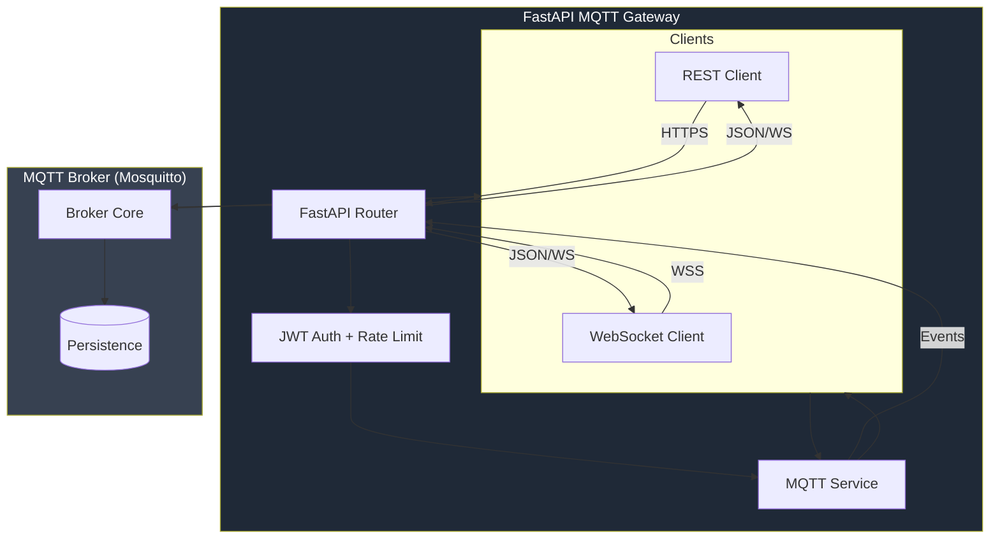

# FastAPI MQTT Gateway

Production-ready REST/WebSocket → MQTT bridge with authentication, rate limiting, and real-time streaming.

## Features

- **REST API**: Publish, subscribe, unsubscribe, query retained messages
- **WebSocket**: Real-time MQTT message streaming with topic filtering
- **JWT Authentication**: Secure token-based auth with configurable expiry
- **Rate Limiting**: Per-endpoint rate limits via SlowAPI
- **Topic Management**: Subscription tracking, allowed/blocked patterns
- **MQTT v5**: Full MQTT 5.0 support with QoS 0-2, retained messages
- **TLS Support**: Secure broker connections
- **Structured Logging**: JSON logs via structlog
- **OpenAPI Docs**: Auto-generated API documentation
- **Docker Ready**: Multi-service compose with Mosquitto broker

## Architecture



## API Endpoints

```mermaid
graph LR
    subgraph API["API Endpoints"]
        subgraph Auth["Authentication"]
            POST_TOKEN["POST /auth/token"]
        end

        subgraph MQTT["MQTT Operations"]
            POST_PUB["POST /mqtt/publish"]
            POST_SUB["POST /mqtt/subscribe"]
            POST_UNSUB["POST /mqtt/unsubscribe"]
            POST_RETAIN["POST /mqtt/retained"]
            GET_TOPICS["GET /mqtt/topics"]
            GET_TOPIC["GET /mqtt/topics/{topic}"]
        end

        subgraph Health["Health"]
            GET_HEALTH["GET /health"]
        end

        subgraph WS["WebSocket"]
            WS_ENDPOINT["WS /ws?topics=#"]
        end

        POST_TOKEN -.->|JWT| Auth
        Auth -.->|Auth Required| WS
```

## Quick Start

### Docker Compose (Recommended)

```bash
# Clone and configure
git clone <repo> fastapi-mqtt-gateway
cd fastapi-mqtt-gateway
cp .env.example .env
# Edit .env with your settings

# Start services
docker-compose up -d

# Check health
curl http://localhost:8000/health
```

### Local Development

```bash
# Install dependencies
pip install -e ".[dev]"

# Start Mosquitto (or use docker-compose for broker only)
docker run -d -p 1883:1883 -p 9001:9001 eclipse-mosquitto:2.0

# Run gateway
uvicorn fastapi_mqtt_gateway.main:app --reload --host 0.0.0.0 --port 8000
```

## Configuration

| Variable | Default | Description |
|----------|---------|-------------|
| `MQTT_BROKER_HOST` | `mqtt-broker` | MQTT broker hostname |
| `MQTT_BROKER_PORT` | `1883` | MQTT broker port |
| `MQTT_USERNAME` | `` | MQTT username (optional) |
| `MQTT_PASSWORD` | `` | MQTT password (optional) |
| `MQTT_USE_TLS` | `false` | Enable TLS |
| `JWT_SECRET_KEY` | *(required)* | JWT signing secret (min 32 chars) |
| `JWT_ACCESS_TOKEN_EXPIRE_MINUTES` | `30` | Access token TTL |
| `RATE_LIMIT_ENABLED` | `true` | Enable rate limiting |
| `LOG_LEVEL` | `INFO` | Log level |

## Usage Examples

### Get Access Token

```bash
curl -X POST http://localhost:8000/auth/token \
  -H "Content-Type: application/x-www-form-urlencoded" \
  -d "username=admin&password=secret"
```

### Publish Message

```bash
TOKEN=<your-token>
curl -X POST http://localhost:8000/mqtt/publish \
  -H "Authorization: Bearer $TOKEN" \
  -H "Content-Type: application/json" \
  -d '{"topic": "gateway/sensors/temp", "payload": "23.5", "qos": 1, "retain": true}'
```

### Subscribe to Topic

```bash
curl -X POST http://localhost:8000/mqtt/subscribe \
  -H "Authorization: Bearer $TOKEN" \
  -H "Content-Type: application/json" \
  -d '{"topic": "gateway/sensors/#", "qos": 1}'
```

### Query Retained Message

```bash
curl -X POST http://localhost:8000/mqtt/retained \
  -H "Authorization: Bearer $TOKEN" \
  -H "Content-Type: application/json" \
  -d '{"topic": "gateway/sensors/temp"}'
```

### WebSocket Streaming

```javascript
const ws = new WebSocket('ws://localhost:8000/ws?topics=gateway/sensors/+,gateway/+/status');

ws.onmessage = (event) => {
  const msg = JSON.parse(event.data);
  if (msg.type === 'ping') return;
  console.log(`${msg.topic}: ${msg.payload}`);
};
```

## Project Structure

```
fastapi-mqtt-gateway/
│
├── config/
│   └── mosquitto.conf          # Broker configuration
│
├── src/fastapi_mqtt_gateway/
│   ├── __init__.py
│   ├── main.py                 # FastAPI application entry
│   │
│   ├── api/
│   │   └── __init__.py         # REST + WebSocket routes
│   │
│   ├── core/
│   │   ├── config.py           # Pydantic settings
│   │   └── auth.py             # JWT authentication
│   │
│   ├── mqtt/
│   │   └── client.py           # Async MQTT client wrapper
│   │
│   ├── models/
│   │   └── __init__.py         # Pydantic request/response models
│   │
│   └── services/
│       └── mqtt_service.py     # Business logic layer
│
├── tests/
│
├── Dockerfile
├── docker-compose.yml
├── pyproject.toml
└── .env.example
```

## Development

```bash
# Install dev dependencies
pip install -e ".[dev]"

# Run tests
pytest -v

# Lint
ruff check src/
ruff format src/

# Type check
mypy src/
```

## Security Considerations

- Change `JWT_SECRET_KEY` in production (min 32 chars)
- Enable `MQTT_USE_TLS` with valid certificates
- Configure `ALLOWED_TOPIC_PATTERNS` / `BLOCKED_TOPIC_PATTERNS`
- Use strong passwords for MQTT broker authentication
- Run behind reverse proxy with TLS termination
- Monitor rate limit metrics for abuse detection

## Monitoring

- Health endpoint: `GET /health`
- Prometheus metrics via `mqtt-exporter` (port 9234)
- Structured JSON logs to stdout

## License

MIT